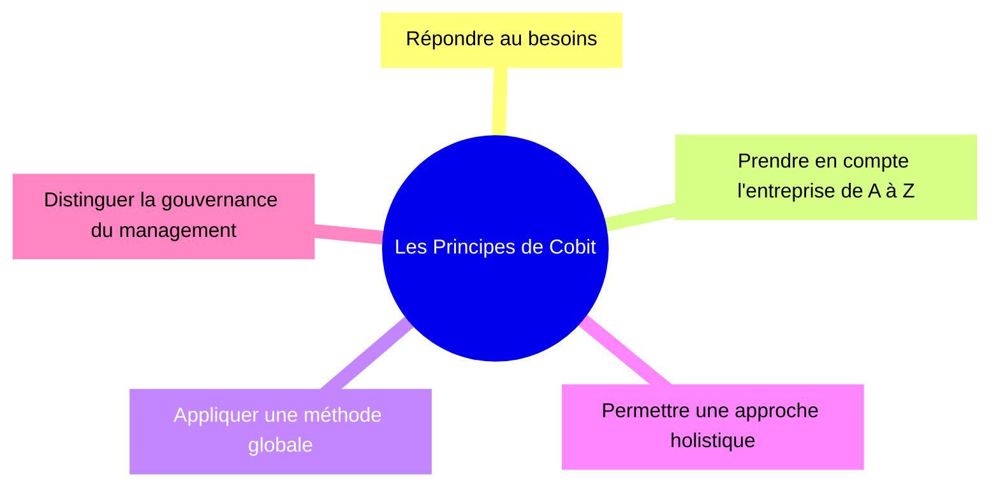

Mise à jour : {frontMatter.last_updated.date} par {frontMatter.last_updated.author}

CobIT vise à rassembler des bonnes pratiques puisées dans les référentiels qui ont fait leurs preuves. On retrouvera donc, entre autres, des éléments de CMMI et ITIL

CobIT 5 est un produit de l’ISACA

CobIT établie clairement le partage des responsabilités entre la gouvernance et le management.

La gouvernance est l’organe qui défini les objectifs économiques, donne les directives et détermine les politiques. Le management est à son service pour piloter l’activité de mise en oeuvre. Elle aura ses propres objectifs qui devront être cohérents avec la stratégie de l’entreprise.

## Les principes

Le COBIT 5 repose sur deux ensembles de principes :

- des principes décrivant les exigences fondamentales d'un système de gouvernance pour l'information et les technologies d'entreprise (entreprise I&T) 
- des principes pour créer un cadre de gouvernance pouvant servir à construire un système de gouvernance pour l'entreprise.

### Principes pour un système de gouvernance

Voyons maintenant les 6 principes :

### Principes pour un cadre de gouvernance
Nous avons également 3 principes pour le cadre de gouvernance :

1. Modèle conceptuel : Identifier les composants clés et les relations entre eux.
2. Ouvert et flexible : Ouvert et flexible, pour permettre l'ajout de nouveau contenu et la capacité de traiter de nouveaux problèmes de manière flexible.
3. Aligné sur les principales normes : Aligner sur les normes, cadres et réglementations majeurs pertinents.

## Les domaines

Les domaines sont des regroupements de processus
Cobit regroupe les processus en fonction du type d’activité concernée

## 🧭 Processus

CobIT 5 est doté d’un modèle de processus basé sur l’ISO 15504 et sa norme d’évaluation de processus. Les objectifs de ce modèle sont l’évaluation de processus et l’accompagnement de l’amélioration de processus, c’est-à-dire qu’il fournit un moyen de mesurer la performance de n’importe quel processus de gouvernance (basé sur EDM) et de management (basé sur PBRM) et permet d’identifier les domaines d’amélioration.

### Evaluer, diriger et monitorer

Le domaine EDM regroupe les processus de gouvernance qui permettent de prendre en compte les besoins métiers et les retours du management.

Les processus proposés sont :

- EDM01 - Garantir la définition et le maintien du cadre de la gouvernance
- EDM02 - Garantir la production de bénéfices
- EDM03 - Garantir l’optimisation des risques
- EDM04 - Garantir l’optimisation des ressources
- EDM05 - Garantir la transparence pour les parties prenantes

### Aligner, planifier et organiser

Le domaine APO regroupe les processus concernant la planification. Il est lié à la prise en compte des directives de la gouvernance.

Les processus proposés sont :

- APO01 - Gérer le cadre informatique
- APO02 - Gérer la stratégie
- APO03 - Gérer l’architecture de l’entreprise
- APO04 - Gérer l’innovation
- APO05 - Gérer le portefeuille de services
- APO06 - Gérer les budgets et les coûts
- APO07 - Gérer les ressources humaines
- APO08 - Gérer les partenariats
- APO09 - Gérer les accords de service
- APO10 - Gérer les fournisseurs
- APO11 - Gérer la qualité
- APO12 - Gérer les risques
- APO13 - Gérer la sécurité

### Bâtir, acquérir et implémenter

Le domaine BAI regroupe les processus concernant la mise en oeuvre. Il est lié à la réalisation de ce qui a été planifié.

Les processus proposés sont :

- BAI01 - Gérer les programmes et les projets
- BAI02 - Gérer la définition des exigences
- BAI03 - Gérer l’identification des solutions et leur production
- BAI04 - Gérer la disponibilité et la capacité
- BAI05 - Gérer l’aptitude organisationnelle au changement
- BAI06 - Gérer les changements
- BAI07 - Gérer la conduite du changement
- BAI08 - Gérer les connaissances
- BAI09 - Gérer les actifs
- BAI10 - Gérer la configuration

### Délivrer services et support

Le domaine DSS regroupe les processus concernant la maintenance. Il est lié au maintien en conditions opérationnelles de ce qui a été mis en oeuvre.

Les processus proposés sont :

- DSS01 - Gérer la production
- DSS01 - Gérer les incidents et les demandes
- DSS03 - Gérer les problèmes
- DSS04 - Gérer la continuité
- DSS05 - Gérer les services de sécurité
- DSS06 - Gérer le contrôle des processus métiers

### Monitorer, évaluer et analyser

Le domaine MEA regroupe les processus concernant le pilotage de l’activité. Il est lié au suivi et à l’évaluation.

Les processus proposés sont :

- MEA01 - Piloter et évaluer la performance et la conformité
- MEA02 - Piloter et évaluer le système de contrôle interne
- MEA03 - Piloter et évaluer la conformité aux exigences externes

## 📋 Grille d’évaluation COBIT 5

Chaque processus est évalué selon les critères suivants :

| Critère | Description |
| ------- | ----------- |
| Objectif du processus | Finalité métier ou IT visée |
| Niveau de maturité | Échelle de 0 (inexistant) à 5 (optimisé) |
| Risques identifiés | Risques liés à la non-maîtrise du processus |
| Indicateurs clés (KPI) | Mesures de performance ou de conformité |
| Documentation existante | Procédures, politiques, rapports |
| Responsables | Rôles ou entités en charge du processus |
| Recommandations | Actions d’amélioration proposées |
| Priorité d’action | Faible / Moyenne / Haute |

Voici une grille d’évaluation complète pour les 37 processus COBIT 5, conçue pour auditer ton système d'information. Elle est structurée pour te permettre d’évaluer chaque processus selon des critères clés : objectif, maturité, risques, indicateurs, documentation, responsables, recommandations et priorité.

### Structure des niveaux de maturité COBIT 5

Chaque processus est évalué selon 6 attributs de performance :

- Performance du processus
- Gestion du processus
- Définition du processus
- Mesure du processus
- Contrôle du processus
- Amélioration du processus

Les niveaux de capacité sont :

| Niveau | Description | Détail |
| ------ | ----------- | ------ |
| 0 – Inexistant | Le processus n’est pas mis en œuvre | Aucun objectif défini, aucune activité formalisée, aucune responsabilité attribuée |
| 1 – Initial / Ad hoc | Activités non planifiées, informelles | Le processus existe de manière informelle, dépend des individus, sans documentation ni contrôle |
| 2 – Géré | Activités répétables mais non standardisées | Le processus est exécuté, les responsabilités sont connues, mais il n’est pas documenté ni mesuré |
| 3 – Défini | Processus standardisé et documenté | Le processus est formalisé, documenté, appliqué de manière cohérente dans l’organisation |
| 4 – Quantitativement géré | Mesure et contrôle du processus | Le processus est mesuré, les performances sont suivies, les écarts sont analysés et corrigés |
| 5 – Optimisé | Amélioration continue | Le processus est optimisé en continu, avec innovation, retour d’expérience et automatisation possible |

### Exemple appliqué : DSS02 – Gérer les demandes de service et les incidents

| Niveau | État du processus |
| ------ | ----------------- |
| 0 | Aucun helpdesk, les incidents ne sont pas enregistrés |
| 1 | Les utilisateurs contactent directement les techniciens, sans procédure |
| 2 | Un helpdesk existe, les incidents sont enregistrés mais sans analyse |
| 3 | Procédure ITIL formalisée, SLA définis, documentation disponible  |
| 4 | Taux de résolution mesuré, tableaux de bord, analyse des causes |
| 5 | Automatisation, chatbot, amélioration continue, retour utilisateur intégré |

### 🛠️ Exemple appliqué : APO13 – Gérer la sécurité

| Niveau | État du processus |
| ------ | ----------------- |
| 0 | Aucune politique de sécurité, pas de contrôle |
| 1 | Des mesures ponctuelles sont prises en cas d’incident |
| 2 | Politique SSI rédigée, antivirus déployés, sensibilisation limitée |
| 3 | Politique appliquée, audits réguliers, gestion des accès structurée |
| 4 | Indicateurs de sécurité suivis, analyse des incidents, conformité RGPD |
| 5 | SOC, SIEM, gestion proactive, simulation d’attaques, culture sécurité forte |

### 🧩 Modèle de grille d'évaluation

Chaque ligne correspond à un processus. Tu peux l'utiliser dans un tableau Excel ou un outil de gestion de projet.

| **Domaine** | **Code** | **Processus** | **Objectif métier/IT** | **Maturité 0** | **Maturité 1** | **Maturité 2** | **Maturité 3** | **Maturité 4** | **Maturité 5** | **Note** | **Risques clés** | **KPI principaux** | **Documentation existante** | **Responsable(s)** | **Recommandations** | **Priorité** |
| --- | --- | --- | --- | --- | --- | --- | --- | --- | --- | --- | --- | --- | --- | --- | --- | --- |
| EDM | EDM01 | Gouvernance de l'IT | Alignement stratégique | Pas de gouvernance formelle ; décisions IT ad hoc ; aucun rôle de pilotage défini. | Quelques comités informels ; initiatives ponctuelles du management ; responsabilités personnelles non documentées. | Comité de gouvernance établi ; rôles identifiables ; politiques de gouvernance basiques rédigées mais pas systématiquement appliquées. | Cadre de gouvernance formalisé ; organigramme, comités et RACI documentés ; cycles de revue réguliers. | Gouvernance mesurée via KPI (alignement, valeur, risque) ; actions correctives suivies ; SLAs gouvernance/OLAs formels. | Gouvernance optimisée et intégrée au pilotage stratégique ; amélioration continue basée sur données ; partage de bonnes pratiques. |     | Manque de pilotage stratégique | Alignement IT/métier | Charte de gouvernance | Direction SI |     |     |
| EDM | EDM02 | Création de valeur | Maximiser la valeur IT | Aucune démarche pour mesurer valeur IT ; investissements non justifiés. | Projets évalués au cas par cas ; ROI informel ou absent. | Processus de sélection d'investissements en place ; business cases intermittents. | Portefeuille piloté autour de la valeur ; critères d'évaluation standardisés ; revue post-projet systématique. | Mesures quantitatives de création de valeur (ROI, NPV, indicateurs métiers) suivies ; optimisation portefeuille. | Cycle continu d'optimisation de valeur ; innovation orientée valeur ; benchmarking et amélioration proactive. |     | Investissements non rentables | ROI des projets IT | Plan stratégique | DG / DSI |     |     |
| EDM | EDM03 | Gestion des risques | Réduire les risques IT | Pas d'identification formelle des risques IT. | Identification ponctuelle après incident ; responsabilités non formalisées. | Registre des risques existant ; évaluations qualitatives périodiques. | Processus de gestion des risques documenté ; priorisation, plans de traitement et suivi. | Mesures quantitatives des risques (scénarios, vraisemblance/impact) ; intégration risque-performance. | Gestion proactive et prédictive des risques ; stress tests, simulation d'incidents ; culture du risque partagée. |     | Incidents majeurs | Nb d'incidents critiques | Cartographie des risques | RSSI |     |     |
| EDM | EDM04 | Gestion des ressources | Optimiser les ressources | Pas de suivi des ressources IT (humaines, financières, infra). | Inventaires partiels ; allocation réactive. | Suivi régulier des ressources ; planning et budgets basiques. | Optimisation planifiée des ressources ; reporting capacitaire ; gestion des compétences. | Analyse quantitative de l'utilisation ; optimisation coût-performance ; capacity planning avancé. | Allocation dynamique et automatisée des ressources ; amélioration continue et alignement stratégique. |     | Sous-utilisation / surcharge | Taux d'utilisation | Plan de ressources | RH / DSI |     |     |
| EDM | EDM05 | Transparence et conformité | Respect des obligations | Non-respect fréquent des obligations ; pas de suivi de conformité. | Conformité traitée après incidents ; quelques contrôles ponctuels. | Registre des obligations et contrôles minimaux ; audits internes occasionnels. | Programme de conformité formalisé ; contrôles programmés ; reporting aux dirigeants. | Mesures de conformité intégrées et automatisées ; démonstration de conformité périodique. | Conformité intégrée au modèle d'affaires ; amélioration continue et conformité pro-active. |     | Sanctions / image | Nb de non-conformités | Politique conformité | DPO / Juridique |     |     |
| APO | APO01 | Cadre de gouvernance | Définir les règles | Aucun cadre ; pratiques disparates. | Principes locaux ; absence de standardisation. | Cadre de gouvernance documenté ; application inégale. | Cadre adopté à l'échelle ; templates, politiques et guides disponibles. | Mesure de l'application du cadre ; conformité contrôlée. | Cadre optimisé, intégration continue et révision basée sur retours métier. |     | Flou organisationnel | Existence du cadre | Manuel de gouvernance | DSI |     |     |
| APO | APO02 | Stratégie IT | Alignement avec la stratégie métier | Pas de stratégie IT formelle. | Stratégie rédigée ponctuellement ; faible articulation avec métiers. | Stratégie IT alignée partiellement au métier ; plan stratégique avec initiatives. | Stratégie déployée, KPI stratégiques, revue annuelle. | Pilotage stratégique basé sur indicateurs ; ajustements en continu. | Stratégie adaptive, intégration de l'innovation et scénarios prospectifs. |     | Décalage IT/métier | Alignement stratégique | Schéma directeur | DSI / DG |     |     |
| APO | APO03 | Architecture d'entreprise | Cohérence des systèmes | Pas de cartographie ; silos applicatifs. | Cartographies partielles, informelles. | Référentiel d'architecture en construction ; normes basiques. | Architecture d'entreprise documentée et gouvernée ; référentiel adopté. | Architecture contrôlée par métriques ; intégration et réutilisation des composants. | Architecture optimisée, automatisation de la conformité et gouvernance évolutive. |     | Systèmes redondants | Nb d'interfaces / redondances | Cartographie SI | Urbaniste SI |     |     |
| APO | APO04 | Innovation | Favoriser l'innovation | Aucune démarche d'innovation. | Initiatives individuelles ; veille non structurée. | Processus d'idéation formel ; pilotes isolés. | Pipeline d'innovation structuré ; priorisation et validation métier. | Mesure d'impact des innovations ; passage à l'échelle systématique. | Culture d'innovation intégrée, R&D continue et adoption rapide. |     | Retard technologique | Nb de projets innovants | Veille technologique | Innovation |     |     |
| APO | APO05 | Portefeuille | Gérer les projets | Pas de gestion de portefeuille ; projets gérés isolément. | Liste de projets sans priorisation. | Priorisation basique ; ressources allouées au coup par coup. | Portefeuilles pilotés par valeur, risques et dépendances. | Optimisation portefeuille par analyses quantitatives ; arbitrages dynamiques. | Gouvernance portefeuille intégrée, réallocation proactive et optimisation continue. |     | Projets non alignés | Taux de succès projets | Portefeuille projets | PMO |     |     |
| APO | APO06 | Budget et coûts | Maîtriser les dépenses | Pas de suivi coûts IT. | Budgets historiques ; suivi ad hoc. | Budgétisation formalisée ; contrôles de dépense basiques. | Suivi budget vs réalisation ; analyses ROI/variance régulières. | Modèles de coût par service ; optimisation coûts/valeur. | Gestion financière avancée, automatisation des rapports, optimisation continue. |     | Dépassements | Respect du budget | Budget IT | Contrôle de gestion |     |     |
| APO | APO07 | Ressources humaines | Compétences adaptées | Pas de planification RH IT. | Recrutements réactifs, compétences non cartographiées. | Cartographie compétences ; plans de formation ad hoc. | Parcours RH IT, gestion des talents et mobilité définis. | Stratégie compétences anticipative basée sur besoins métiers. | Approche prédictive des compétences, rétention et culture forte. |     | Manque de compétences | Taux de formation / turnover | Plan de formation | RH / DSI |     |     |
| APO | APO08 | Relations | Relations internes/externes | Communications rares entre IT et métiers. | Échanges ponctuels ; absence de formalisation. | Points de contact réguliers ; SLA relationnels basiques. | Gouvernance des relations documentée ; comité métiers/IT actif. | Mesure de satisfaction ; ajustements proactifs. | Relations partenariales, co-innovation et alignement continu. |     | Mauvaise communication | Satisfaction des parties prenantes | Plan de communication | DSI / DG |     |     |
| APO | APO09 | Accords de service | Qualité de service | Aucune SLA formelle. | SLA informels ; non mesurés. | SLA définis pour services critiques ; suivi limité. | Catalogue de services et SLA formalisés, reporting périodique. | SLA liés à coûts et performances ; pénalités/OLAs gérés. | SLA dynamiques, automatisation du suivi et amélioration continue. |     | SLA non respectés | Taux de respect des SLA | Catalogue de services | DSI / Support |     |     |
| APO | APO10 | Fournisseurs | Gérer les prestataires | Achats ad hoc sans gestion fournisseurs. | Contrats ponctuels, évaluation limitée. | Processus sourcing en place ; évaluations périodiques. | Gestion fournisseurs structurée ; KPIs de performance. | Relations stratégiques et gestion des risques fournisseurs. | Écosystème fournisseurs optimisé, co-innovation et partenariats intégrés. |     | Dépendance / qualité variable | Évaluation fournisseurs | Contrats / tableaux de bord | Achats / DSI |     |     |
| APO | APO11 | Qualité | Amélioration continue | Pas d'approche qualité. | Contrôles qualité ponctuels. | Politique qualité documentée ; contrôles réguliers. | Processus qualité intégrés au cycle de vie IT. | Mesures qualité avancées et tableau de bord. | Culture qualité, amélioration continue et certifications externes. |     | Non qualité | Taux de conformité | Politique qualité | Qualité / DSI |     |     |
| APO | APO12 | Risques | Identifier et traiter les risques | Aucun processus de gestion des risques opérationnels. | Identification ad hoc lors d'événements. | Registre risques et plans de mitigation pour les risques majeurs. | Processus de gestion des risques intégré, revues périodiques. | Mesures quantitatives, scénarios et stress-tests. | Gestion prédictive et intégrée des risques, retour d'expérience systématique. |     | Risques non identifiés | Nb de risques critiques | Cartographie des risques | RSSI / DSI |     |     |
| APO | APO13 | Sécurité | Protéger les actifs | Aucune politique ni contrôle de sécurité. | Réactions ponctuelles aux incidents ; controls basiques. | Politique SSI formalisée ; mesures techniques déployées. | Programme SSI opérationnel, sensibilisation et contrôles réguliers. | Surveillance centralisée, indicateurs et remédiations rapides. | Posture de sécurité proactive et adaptative, tests réguliers (pentest, redteam). |     | Fuite de données / cyberattaque | Nb d'incidents de sécurité | Politique SSI | RSSI |     |     |
| BAI | BAI01 | Programmes et projets | Gérer les projets | Projets sans méthodologie. | Méthodes ad hoc ; succès dépendant des individus. | Méthodologie de projet utilisée ; gouvernance de projet variable. | Bureau de projet (PMO) en place ; standards et templates appliqués. | Mesure de performance projet, KPIs, analyses de variance. | Amélioration continue du delivery, automatisation et industrialisation. |     | Retards / échecs | Respect des délais / budget | Plan projet | PMO |     |     |
| BAI | BAI02 | Définition des exigences | Besoins clairs | Exigences non formalisées. | Exigences recueillies de façon informelle. | Processus de recueil et validation en place, traçabilité limitée. | Spécifications claires, gestion des changements et traçabilité complète. | Mesure qualité des exigences et impact sur succès projet. | Pratiques d'ingénierie des exigences optimisées (modélisation, tests automatiques). |     | Mauvaise adéquation | Taux de satisfaction utilisateurs | Cahier des charges | AMOA / MOA |     |     |
| BAI | BAI03 | Solutions et identification | Choix des solutions | Choix de solutions non formel. | Études ponctuelles, choix par habitude. | Critères de sélection documentés ; preuve de concept occasionnelle. | Processus de sélection standardisé incluant risques/coûts/opportunités. | Analyses comparatives quantitatives et standardisation des composants. | Plateforme de sélection optimisée, réutilisation et architecture de référence. |     | Solution inadaptée | Taux de réussite des implémentations | Étude de faisabilité | MOE / DSI |     |     |
| BAI | BAI04 | Disponibilité et capacité | Continuité de service | Aucune mesure disponibilité/capacité. | Mesures réactives après incident. | Monitoring basique et plans de capacité pour équipements critiques. | Capacity planning régulier ; SLAs de disponibilité documentés. | Modélisation de la capacité, alerting avancé et scalabilité planifiée. | Autoscaling, optimisation coûts/performance et prévision prédictive. |     | Interruptions | Taux de disponibilité | Plan de capacité | Exploitation |     |     |
| BAI | BAI05 | Changements organisationnels | Accompagnement du changement | Changement organisationnel ignoré. | Actions de communication ponctuelles lors de grands changements. | Plan de conduite du changement existant pour projets majeurs. | Approche structurée : communication, formation, sponsors identifiés. | Mesure de l'adhésion et ajustements basés sur feedback. | Culture du changement intégrée et capacité d'adaptation rapide. |     | Résistance / échec | Taux d'adhésion | Plan de conduite du changement | RH / DSI |     |     |
| BAI | BAI06 | Changements | Gérer les changements techniques | Absence de processus de changement. | Changements non contrôlés provoquant incidents. | Processus de changement institué (CAB) ; adhérence variable. | Changement maîtrisé : planning, tests, rollback et suivi. | Mesure des impacts des changements et optimisation des fenêtres. | Automatisation des déploiements, CI/CD, changements fréquents mais sûrs. |     | Incidents liés aux changements | Nb de changements réussis | Procédure de changement | Exploitation |     |     |
| BAI | BAI07 | Acceptation et transition | Mise en production | Déploiements sans recette ni vérification. | Recette informelle ; acceptation opèrée localement. | Tests formels et critères d'acceptation définis pour projets majeurs. | Processus de transition standardisé ; checklist de mise en production. | Mesure de succès post-déploiement et retours utilisateurs analytiques. | Automatisation des tests et des déploiements, feedback loop rapide. |     | Rejets / bugs | Taux de succès des mises en production | Procédure de déploiement | MOE / Exploit. |     |     |
| BAI | BAI08 | Connaissances | Capitaliser les savoirs | Aucune capitalisation des savoirs. | Connaissances détenues par individus ; documentation informelle. | Base de connaissance existante ; contribution irrégulière. | KB structurée et gouvernée ; processus de mise à jour. | Mesure d'utilisation et qualité des contenus ; intégration au support. | Knowledge management intégré, apprentissage organisationnel et partage automatique. |     | Perte de savoir | Nb de documents / accès | Base de connaissances | Support / DSI |     |     |
| BAI | BAI09 | Actifs | Gérer les équipements | Pas d'inventaire des actifs. | Inventaire partiel, non fiable. | Inventaire maintenu pour actifs critiques ; processus d'enregistrement. | CMDB partiellement opérationnelle et contrôlée. | CMDB complète et intégrée aux processus (incidents, changements). | Gestion automatisée des actifs, cycle de vie optimisé et KPI associés. |     | Perte / obsolescence | Taux d'inventaire | Inventaire / CMDB | Logistique / DSI |     |     |
| BAI | BAI10 | Configuration | Maîtriser les composants | Aucune maîtrise de configuration. | Configurations tenues localement sans gouvernance. | Processus de configuration basique et enregistrements partiels. | CMDB gouvernée, normes de configuration et audits réguliers. | Intégration CMDB / CI aux outils ITSM et tests d'intégrité. | Configuration as code, audits automatiques et conformité continue. |     | Erreurs / incohérences | Taux de conformité | CMDB | Exploitation |     |     |
| DSS | DSS01 | Opérations | Exploitation du SI | Exploitation non organisée. | Opérations réactives dépendant des individus. | Procédures opérationnelles documentées pour tâches critiques. | Opérations standardisées, planning, rotation et supervision. | Monitoring automatisé, KPIs opérationnels et analyses proactives. | Opérations autonomes, optimisées et intégrées aux processus métiers. |     | Pannes / lenteurs | Taux de disponibilité / incidents | Procédures d'exploitation | Exploitation |     |     |
| DSS | DSS02 | Demandes et incidents | Support utilisateurs | Incidents non enregistrés. | Enregistrement informel ; résolutions dépendantes d'individus. | Service desk en place ; triage et enregistrement systématiques. | SLA définis, workflow ITSM et catégories d'incidents. | Analyses RCA systématiques, reporting et mesures de temps de résolution. | Automatisation du support (chatbots), prévention des incidents et expérience utilisateur optimisée. |     | Insatisfaction / perte de temps | Taux de résolution / délai | Procédure helpdesk | Support |     |     |
| DSS | DSS03 | Problèmes | Résolution des causes | Pas de gestion des problèmes ; correction réactive. | Identification ad hoc des causes profondes. | Registre des problèmes et actions correctives ponctuelles. | Processus de gestion des problèmes avec RCA et suivi des solutions. | Mesure de l'impact des actions préventives ; réduction des incidents récurrents. | Approche proactive et prédictive des problèmes, analytics et remédiations automatiques. |     | Répétition des incidents | Nb de problèmes récurrents | Base de problèmes | Support / Exploit. |     |     |
| DSS | DSS04 | Continuité | Continuité d'activité | Aucune préparation à la continuité. | Plans rudimentaires pour quelques services critiques. | PCA/PRA documentés pour services stratégiques ; tests limités. | Tests réguliers, priorisation des services et plans de reprise éprouvés. | Capacité de reprise mesurée, SLA de reprise respectés ; amélioration post-test. | Continuité intégrée, reprise automatisée et résilience proactive. |     | Arrêt du SI | Temps de reprise | PCA / PRA | RSSI / DSI |     |     |
| DSS | DSS05 | Sécurité des services | Sécuriser les services | Aucune maîtrise sécurité pour les services. | Mesures de sécurité basiques appliquées sporadiquement. | Contrôles de sécurité standard pour services critiques. | Sécurité intégrée au cycle de vie des services, gestion des accès. | Surveillance continue, détection et remédiation automatisées. | Services sécurisés par conception, protections avancées et threat intelligence intégrée. |     | Intrusions / pertes | Nb d'incidents de sécurité | Politique SSI | RSSI / Exploit. |     |     |
| DSS | DSS06 | Contrôles | Contrôles opérationnels | Aucun contrôle opérationnel défini. | Contrôles ad hoc suite à incidents. | Contrôles documentés pour processus majeurs. | Approche systématique des contrôles, tests périodiques. | Contrôles mesurés et optimisés ; reporting au management. | Contrôles automatisés, audits continus et amélioration continue. |     | Fraudes / erreurs | Nb de contrôles effectués | Plan de contrôle | Audit interne |     |     |
| MEA | MEA01 | Performance | Suivi des performances | Pas de suivi de performance. | Indicateurs ponctuels, rapports non structurés. | Tableaux de bord pour quelques domaines ; périodicité limitée. | KPIs cohérents, reporting régulier et revues de performance. | Analyses avancées, corrélations métier/IT et maîtrise des tendances. | Pilotage prédictif, benchmarking externe et optimisation continue. |     | Non atteinte des objectifs | KPI / tableaux de bord | Rapport de performance | DSI / DG |     |     |
| MEA | MEA02 | Contrôle interne | Maîtrise des processus | Aucun cadre de contrôle interne. | Contrôles isolés ; dépendance à des individus. | Répertoire des contrôles et tests ponctuels. | Programme de contrôle interne documenté et exécuté. | Tests réguliers, scoring des contrôles et remédiations suivies. | Contrôles intégrés, automatisés et audités continuellement. |     | Dysfonctionnements | Nb de non-conformités | Cartographie des contrôles | Audit interne |     |     |
| MEA | MEA03 | Conformité | Respect des obligations | Conformité non gérée. | Actions réactives après non-conformité. | Registre des obligations et contrôles de conformité pour domaines clés. | Programme de conformité opérationnel, audits et reporting. | Conformité mesurée, indicateurs et gestion proactive des obligations. | Conformité intégrée dans les processus métier et IT, démonstration continue aux régulateurs. |     | Sanctions / image |     |     |     |     |     |